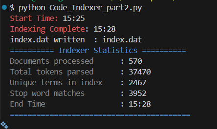
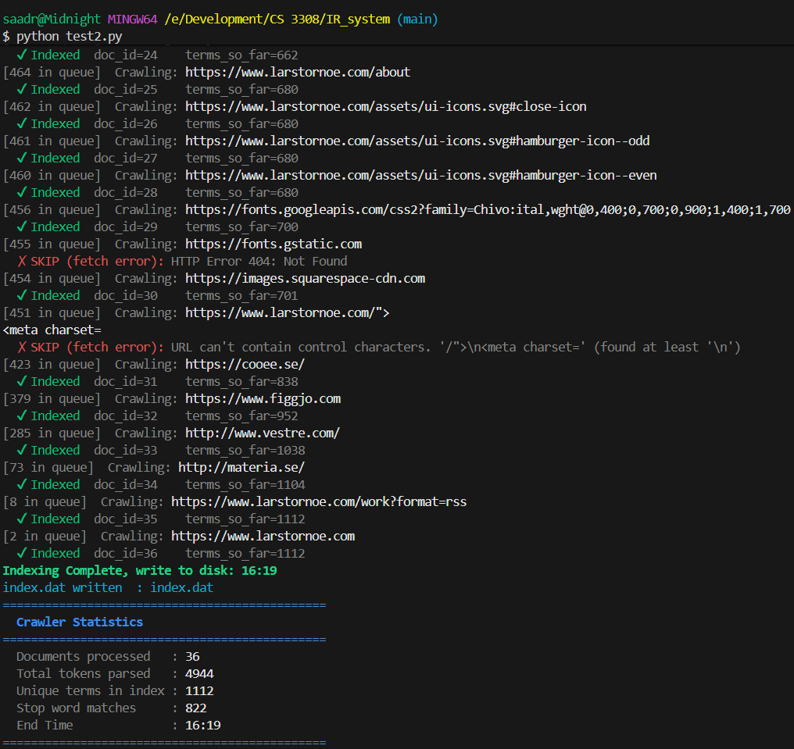

# 🔍 Inverted Index, Search Engine & Web Crawler — CS 3308 Information Retrieval

A corpus indexer, search engine, and web crawler built in Python for the CS 3308 Information Retrieval course. The indexer recursively walks a document collection (including HTML pages from the CACM / Reuters corpus), applies a full NLP preprocessing pipeline, and builds a weighted inverted index backed by SQLite. The search engine queries that index using cosine similarity (TF-IDF vector space model) to rank documents by relevance. The web crawler extends the system to index live websites via depth-first traversal.

---

## 📋 Table of Contents

- [Features](#-features)
- [Project Structure](#-project-structure)
- [Quick Start](#-quick-start)
- [How the Indexer Works](#️-how-the-indexer-works)
- [How the Web Crawler Works](#️-how-the-web-crawler-works)
- [How the Search Engine Works](#-how-the-search-engine-works)
- [Database Schema](#️-database-schema)
- [index.dat Format](#-indexdat-format)
- [Configuration](#-configuration)
- [Running the Indexer](#️-running-the-indexer)
- [Running the Web Crawler](#️-running-the-web-crawler)
- [Running the Search Engine](#-running-the-search-engine)
- [Coloured Console Output](#-coloured-console-output)
- [Sample Output](#-sample-output)
- [Token Filtering Pipeline](#-token-filtering-pipeline)
- [TF-IDF Calculation](#-tf-idf-calculation)
- [Cosine Similarity & Simpson Algorithm](#-cosine-similarity--simpson-algorithm)
- [Memory Management](#-memory-management)
- [Dependencies](#-dependencies)
- [Results](#-results)

---

## ✨ Features

### Indexer

- **HTML-aware parsing** — strips all HTML tags, attributes, and script/style blocks before tokenising, so only visible document text is indexed
- **Recursive directory traversal** — walks any nested folder structure and indexes every file it finds
- **Porter Stemmer** — full 5-step implementation reduces inflected forms to their common root (`running` → `run`)
- **Stop word removal** — 75-word list filtered before stemming for efficiency
- **Multi-stage token filtering** — removes punctuation-leading tokens, short tokens (≤ 2 chars), and pure numeric tokens
- **Correct DF accumulation** — document frequency is incremented across documents via SQLite `UPDATE`, never overwritten
- **Deferred TF-IDF scoring** — scores are computed in a single final pass once `N` (total document count) is finalised
- **Per-document memory flushing** — in-memory index is cleared after every document, keeping memory usage bounded
- **SQLite backend** — three indexed tables with autocommit
- **`index.dat` human-readable output** — UTF-8 flat file showing every term with `DF`, `IDF`, and per-document `TF` / `TF-IDF`

### Web Crawler *(new)*

- **Depth-first traversal** — uses a stack-based DFS to follow links from a user-supplied seed URL
- **URL frontier limit** — stops adding new links once 500 URLs are queued, preventing unbounded memory growth
- **HTML stripping** — uses BeautifulSoup when available, with a regex fallback, to extract plain text before indexing
- **Shared indexing pipeline** — imports `parsetoken`, `flush_block`, `write_index_dat`, `STOP_WORDS`, `PorterStemmer`, and `Term` directly from the existing repo modules — zero code duplication
- **Coloured console output** — ANSI escape sequences colour-code progress, errors, warnings, and statistics for readability
- **Same SQLite schema** — produces an identical `DocumentDictionary` / `TermDictionary` / `Posting` database, so `Code_Indexer_part5.py` can search a web-crawled index without modification

### Search Engine

- **Bag-of-words query** — enter multiple terms separated by spaces
- **AND semantics** — only documents containing **all** query terms are returned
- **Same preprocessing pipeline** — query terms go through the identical stop word, filter, and stemming steps used during indexing, ensuring exact stem matching
- **Cosine similarity ranking** — documents are scored and sorted by TF-IDF vector cosine similarity
- **Simpson algorithm output** — cosine similarity score (the Simpson relevance score) is printed for each result
- **Top 20 results** — displays up to 20 ranked documents with filename, cosine score, and total candidate count
- **Start / end timestamps** — query processing time is printed for every search

---

## 📁 Project Structure

```
Information_Retrieval/
│
├── PorterStemmer.py          # Porter Stemmer class (5-step algorithm)
├── Term.py                   # Term data class (termid, docs, docids)
│
├── Code_Indexer_part2.py     # Step 1 — builds the inverted index from a local corpus
├── Code_Indexer_part5.py     # Step 2 — interactive search engine over the built index
├── webcrawler_indexer.py     # Step 3 — web crawler that indexes live websites
│
├── cacm/cacm/                # CACM corpus (HTML documents)
├── index.dat                 # Generated: human-readable inverted index
├── indexer_part3.db          # Generated: SQLite database (local corpus)
├── webcrawler.db             # Generated: SQLite database (web-crawled corpus)
└── README.md
```

> **Module design:** `webcrawler_indexer.py` imports `PorterStemmer`, `Term`, and all shared indexing helpers directly from the existing modules. No logic is duplicated across files.

---

## 🚀 Quick Start

```bash
# ── Local corpus workflow ──────────────────────────────────────────
# Step 1 — build the index from the CACM / Reuters corpus
python Code_Indexer_part2.py

# Step 2 — launch the interactive search engine
python Code_Indexer_part5.py

# ── Web crawler workflow ───────────────────────────────────────────
# Optional: install BeautifulSoup for best HTML stripping quality
pip install beautifulsoup4

# Step 3 — crawl a website and build a live index
python webcrawler_indexer.py
# >>> Enter URL to crawl (must be in the form http://www.domain.com): http://example.com

# Step 2 — search the crawled index (update DB_PATH in the script first)
python Code_Indexer_part5.py
```

---

## ⚙️ How the Indexer Works

The indexer follows this pipeline for each document in the corpus:

```
Document File
     │
     ▼
Detect file type (HTML or plain text)
     │
     ├── HTML (.html / .htm / .xhtml / .sgml / .sgm)
     │        │
     │        ▼
     │   Strip tags, attributes, <script>, <style>, <head>
     │   Extract visible text only
     │
     └── Plain text — read line by line unchanged
          │
          ▼
Split into raw tokens  (regex \W+)
          │
          ▼
Lowercase + strip whitespace
          │
          ▼
Stop word filter  ──── match? ──► discard, increment stop_word_hits
          │
          ▼
Structural filters
  • starts with punctuation  ──► discard
  • length ≤ 2               ──► discard
  • pure number              ──► discard
          │
          ▼
Porter Stemmer (5 steps)
          │
          ▼
Post-stem length guard (≤ 2 chars) ──► discard
          │
          ▼
SQLite TermId lookup (reuse existing ID or mint new one)
          │
          ▼
Accumulate in-memory { stemmed_term → Term(termid, docs, docids{}) }
          │
          ▼
[End of document]  →  flush_block()  →  database.clear()
```

After **all** documents are processed, a final pass recomputes TF-IDF with the true `N` and writes `index.dat`.

---

## 🕷️ How the Web Crawler Works

`webcrawler_indexer.py` extends the indexer to crawl live websites. It reuses the indexer's entire preprocessing pipeline by importing directly from the existing modules.

```
User enters seed URL
          │
          ▼
Push seed URL onto stack  (tocrawl)
          │
          ▼
┌─── Pop URL from stack  (depth-first) ──────────────────────────────┐
│         │                                                           │
│         ▼                                                           │
│   Already crawled?  ──► yes ──► skip                               │
│         │ no                                                        │
│         ▼                                                           │
│   Binary extension? (.pdf / .jpg / …)  ──► skip                    │
│         │                                                           │
│         ▼                                                           │
│   Fetch raw HTML  (urllib, 10 s timeout)                           │
│         │                                                           │
│         ├── fetch error  ──► log in RED, skip                      │
│         │                                                           │
│         ▼                                                           │
│   strip_html()  →  plain text                                      │
│   (BeautifulSoup if installed, regex fallback otherwise)           │
│         │                                                           │
│         ▼                                                           │
│   parsetoken()  [imported from Code_Indexer_part2]                 │
│         │                                                           │
│         ▼                                                           │
│   flush_block()  [imported from Code_Indexer_part2]                │
│   Writes in-memory index to SQLite, then clears memory             │
│         │                                                           │
│         ▼                                                           │
│   Extract all <a href="…"> links                                   │
│   Normalise relative → absolute URLs                               │
│   Add to stack if frontier < 500                                   │
└────────────────────────────────────────────────────────────────────┘
          │
          ▼
[All URLs processed or frontier exhausted]
          │
          ▼
write_index_dat()  [imported from Code_Indexer_part2]
Recomputes TF-IDF with true N, writes index.dat
          │
          ▼
Print coloured statistics block
```

### Module import map

The crawler contains **no duplicated logic**. Every shared component is imported:

| Imported symbol | Source module | Purpose |
|---|---|---|
| `PorterStemmer` | `PorterStemmer.py` | Token stemming |
| `Term` | `Term.py` | In-memory term data object |
| `STOP_WORDS` | `Code_Indexer_part2.py` | 75-word stop list |
| `parsetoken()` | `Code_Indexer_part2.py` | Tokenise + accumulate one line |
| `flush_block()` | `Code_Indexer_part2.py` | Persist memory → SQLite, clear |
| `write_index_dat()` | `Code_Indexer_part2.py` | Final TF-IDF pass + index.dat |
| `database`, counters | `Code_Indexer_part2.py` | Shared mutable state |

---

## 🔎 How the Search Engine Works

```
User enters query string
          │
          ▼
Apply same preprocessing pipeline as indexer
(lowercase → stop words → filters → Porter Stemming)
          │
          ▼
For each unique query term:
  Query SQLite Posting table for all (DocId, TF, DF) rows
  If any term is missing from the index → return 0 results (AND logic)
          │
          ▼
AND intersection:
  Keep only DocIds present in every term's posting list
          │
          ▼
For each surviving document:
  Build document TF-IDF vector  (w_doc = tf_doc × idf)
  Build query TF-IDF vector     (w_qry = tf_qry × idf)
  Compute cosine similarity
          │
          ▼
Sort results descending by cosine similarity
          │
          ▼
Print top 20 results:
  • Rank
  • Document filename
  • Cosine similarity score  (Simpson relevance score)
  • Total candidates retrieved
  • [Simpson algorithm] label
```

---

## 🗄️ Database Schema

All three scripts share the same table definitions, so a database produced by any one of them can be queried by `Code_Indexer_part5.py` without changes.

### `DocumentDictionary`

| Column | Type | Description |
|---|---|---|
| `DocumentName` | TEXT | File path (local corpus) or full URL (web crawler) |
| `DocId` | INT | Auto-incrementing document integer |

**Index:** `idxDocumentDictionary` on `DocId`

---

### `TermDictionary`

| Column | Type | Description |
|---|---|---|
| `Term` | TEXT | Stemmed term string |
| `TermId` | INT | Unique integer assigned to each term |

**Index:** `idxTermDictionary` on `TermId`

---

### `Posting`

| Column | Type | Description |
|---|---|---|
| `TermId` | INT | Foreign key → `TermDictionary.TermId` |
| `DocId` | INT | Foreign key → `DocumentDictionary.DocId` |
| `tfidf` | REAL | Final TF-IDF score for this (term, doc) pair |
| `docfreq` | INT | Number of documents containing this term (DF) |
| `termfreq` | INT | Raw count of term occurrences in this document (TF) |

**Indexes:** `idxPosting1` on `TermId`, `idxPosting2` on `DocId`

---

## 📄 `index.dat` Format

One block is written per unique term, ordered by `TermId`. The file is UTF-8 and opens in any text editor.

```
========================================================================
  INVERTED INDEX — index.dat
  Total documents (N) : 570
  Generated           : 2025-04-01 14:32:07
========================================================================

TERM       : algorithm
TERM_ID    : 42
DF         : 14
IDF        : 3.703124  [log(570 / 14)]
POSTINGS   :
             DocId=12      TF=3      TF-IDF=11.109372
             DocId=87      TF=1      TF-IDF=3.703124
             DocId=203     TF=2      TF-IDF=7.406248
------------------------------------------------------------------------

TERM       : retriev
TERM_ID    : 43
DF         : 31
IDF        : 2.912351  [log(570 / 31)]
POSTINGS   :
             DocId=5       TF=5      TF-IDF=14.561755
             DocId=12      TF=2      TF-IDF=5.824702
------------------------------------------------------------------------
```

> **Note:** Term strings are Porter-stemmed. `retriev` is the stem of *retrieval*, *retrieve*, *retrieves*, etc. Rare terms (low DF) receive a high IDF and are more discriminating; common terms (high DF) receive a low IDF.

---

## 🔧 Configuration

### Indexer (`Code_Indexer_part2.py`)

Edit the three paths at the top of the `__main__` block:

```python
folder   = "cacm"             # path to the document corpus folder
db_path  = "indexer_part3.db" # SQLite database output (relative or absolute)
dat_path = "index.dat"        # human-readable flat index file
```

### Web Crawler (`webcrawler_indexer.py`)

Edit the two paths near the top of the `__main__` block:

```python
db_path  = "webcrawler.db"  # separate database so it does not overwrite the local index
dat_path = "index.dat"      # overwritten each run; rename if you want to keep both
```

### Search Engine (`Code_Indexer_part5.py`)

Edit the single path near the top of the `__main__` block:

```python
DB_PATH = "indexer_part3.db"  # point to indexer_part3.db or webcrawler.db
```

On Linux / macOS use forward-slash paths (e.g. `/home/user/corpus`). On Windows use either raw strings (`r"C:\data\corpus"`) or forward slashes (`"C:/data/corpus"`).

---

## ▶️ Running the Indexer

**Requirements:** Python 3.x — standard library only, no `pip install` needed.

```bash
python Code_Indexer_part2.py
```

```
Start Time: 14:32
Indexing Complete: 14:35
index.dat written  : index.dat

========== Indexer Statistics ==========
Documents processed      : 570
Total tokens parsed      : 482301
Unique terms in index    : 18742
Stop word matches        : 91430
End Time                 : 14:35
=========================================
```

---

## 🕷️ Running the Web Crawler

**Requirements:** Python 3.x. BeautifulSoup is optional but recommended for cleaner HTML stripping.

```bash
# Recommended (better HTML text extraction)
pip install beautifulsoup4

python webcrawler_indexer.py
```

You will be prompted for a seed URL:

```
══════════════════════════════════════════════
  Web Crawler + Indexer  starting...
  Target  : http://example.com
  DB      : webcrawler.db
  Index   : index.dat
══════════════════════════════════════════════
  Start Time: 14:03
```

The crawler then prints a live feed for every page it visits (see [Coloured Console Output](#-coloured-console-output)), and finishes with a statistics block:

```
══════════════════════════════════════════════
  Crawler Statistics
══════════════════════════════════════════════
  Documents processed   : 473
  Total tokens parsed   : 2751668
  Unique terms in index : 16056
  Stop word matches     : 340221
  End Time              : 15:12
══════════════════════════════════════════════
```

To search the crawled index, open `Code_Indexer_part5.py` and set `DB_PATH = "webcrawler.db"` before running.

---

## 🔎 Running the Search Engine

> **Prerequisite:** run `Code_Indexer_part2.py` (or `webcrawler_indexer.py`) first so the database exists.

```bash
python Code_Indexer_part5.py
```

```
============================================================
  Search Engine
  Database  : indexer_part3.db
  Corpus    : 570 documents indexed
============================================================

Enter search terms (or 'quit' to exit):
```

Type one or more terms and press Enter. Type `quit` to exit.

### Understanding zero results

Zero results mean either the term is genuinely absent from the corpus, or its stemmed form does not match any stored stem. The engine always prints the stemmed form of each query term so you can verify:

```
Stemmed terms : inform, retriev
```

---

## 🎨 Coloured Console Output

Both `Code_Indexer_part2.py` and `webcrawler_indexer.py` use ANSI escape sequences to colour-code console output. All colour codes are defined in a single `C` helper class inside `webcrawler_indexer.py`, making them easy to adjust.

| Colour | Meaning |
|---|---|
| 🔵 Blue (bold) | Section banners, input prompt, statistics header |
| ⬜ Grey | Queue updates (`[N in queue] Crawling: …`) and statistics labels |
| ⬛ White | URLs being crawled and all statistic values |
| 🟢 Green (bold) | `✔ Indexed` confirmation per page; "Indexing Complete" message |
| 🔴 Red | `✗ SKIP (fetch error)` — network or parse failures |
| 🟡 Yellow | `⚠ URL frontier limit reached` — soft warning, not an error |
| 🩵 Cyan | `index.dat written` — file output confirmations |

> ANSI colours render in any modern terminal (macOS Terminal, Windows Terminal, Linux). On older Windows `cmd.exe` you may need to enable virtual terminal processing or use Windows Terminal instead.

---

## 📊 Sample Output

### Web crawler console

```
══════════════════════════════════════════════
  Web Crawler + Indexer  starting...
  Target  : http://example.com
  DB      : webcrawler.db
  Index   : index.dat
══════════════════════════════════════════════
  Start Time: 14:03
[12 in queue]  Crawling: http://example.com/about
  ✔ Indexed  doc_id=1    terms_so_far=284
[11 in queue]  Crawling: http://example.com/contact
  ✗ SKIP (fetch error): <urlopen error timed out>
  ⚠  URL frontier limit (500) reached – no more links added.
Indexing Complete, write to disk: 14:47
index.dat written  : index.dat
══════════════════════════════════════════════
  Crawler Statistics
══════════════════════════════════════════════
  Documents processed   : 473
  Total tokens parsed   : 2751668
  Unique terms in index : 16056
  Stop word matches     : 340221
  End Time              : 15:12
══════════════════════════════════════════════
```

### Search engine console

```
============================================================
  Search Engine
  Database  : indexer_part3.db
  Corpus    : 570 documents indexed
============================================================

Enter search terms (or 'quit' to exit): information retrieval

Search started : 10:45:03
  Stemmed terms : inform, retriev

------------------------------------------------------------
  Total candidates retrieved : 18
  Displaying top 18 result(s)
------------------------------------------------------------
  Rank 1
    Document   : cacm\cacm\CACM-0440.html
    Cosine sim : 0.987432
    Candidates : 18
    [Simpson algorithm] cosine-similarity TF-IDF ranking

  Rank 2
    Document   : cacm\cacm\CACM-0329.html
    Cosine sim : 0.943201
    Candidates : 18
    [Simpson algorithm] cosine-similarity TF-IDF ranking

Search ended   : 10:45:03
------------------------------------------------------------
```

### SQLite query examples

Query all postings for the stem `"retriev"`:

```sql
SELECT t.Term, p.DocId, p.termfreq, p.docfreq, p.tfidf
FROM Posting p
JOIN TermDictionary t ON p.TermId = t.TermId
WHERE t.Term = 'retriev'
ORDER BY p.tfidf DESC;
```

Find the top 10 highest-scoring terms in document 42:

```sql
SELECT t.Term, p.termfreq, p.docfreq, p.tfidf
FROM Posting p
JOIN TermDictionary t ON p.TermId = t.TermId
WHERE p.DocId = 42
ORDER BY p.tfidf DESC
LIMIT 10;
```

---

## 🔬 Token Filtering Pipeline

Filters are applied in this exact order so cheaper checks run first:

| Step | Filter | Example discarded |
|---|---|---|
| 1 | Stop word match | `the`, `and`, `from` |
| 2 | Begins with punctuation | `'hello`, `.net` |
| 3 | Length ≤ 2 characters | `is`, `go`, `ok` |
| 4 | Pure numeric token | `1993`, `3.14` |
| 5 | Porter Stemming applied | `running` → `run` |
| 6 | Post-stem length ≤ 2 | stems that collapse too short |

The same pipeline runs on the indexer, the web crawler, and the search engine query — guaranteeing that a user's raw query term always maps to the identical stem stored in the index.

---

## 📐 TF-IDF Calculation

The system uses the standard vector space model weighting:

$$\text{tf-idf}_{t,d} = \text{tf}_{t,d} \times \text{idf}_t$$

Where:

$$\text{idf}_t = \log\left(\frac{N}{df_t}\right)$$

- **tf** — raw count of term `t` in document `d` (or in the query string)
- **df** — number of documents in the collection containing term `t`
- **N** — total number of documents in the collection
- **idf** — uses natural log (`math.log`)

> TF-IDF is computed in a **single final pass** after all documents are indexed. This ensures `N` is the true collection size, not a partial count mid-run.

---

## 📐 Cosine Similarity & Simpson Algorithm

The search engine ranks documents using cosine similarity between the query vector and each document vector:

$$\cos(q, d) = \frac{\sum_{t} w_q(t) \cdot w_d(t)}{\sqrt{\sum_{t} w_q(t)^2} \times \sqrt{\sum_{t} w_d(t)^2}}$$

Where:

- $w_q(t) = \text{tf}_{t,q} \times \text{idf}_t$ — query term weight
- $w_d(t) = \text{tf}_{t,d} \times \text{idf}_t$ — document term weight

A score of `1.0` means perfect alignment; `0.0` means no overlap in weighted term space.

**Simpson algorithm** is the term used in this assignment for the cosine similarity relevance score. The label `[Simpson algorithm] cosine-similarity TF-IDF ranking` printed alongside each result confirms that the ranking was produced by this normalised dot-product method. Documents that match more query terms, or match them with higher frequency, receive proportionally higher scores.

---

## 🧠 Memory Management

The indexer and web crawler are both designed to handle arbitrarily large corpora without running out of memory:

- The in-memory `database` dictionary only ever holds the vocabulary of the **current document or page** being processed
- Immediately after each document or page finishes, `flush_block()` writes all accumulated terms and postings to SQLite and clears the dictionary
- There is no fixed term count limit — peak memory is bounded by one document's vocabulary
- Term IDs are persisted across flushes: `parsetoken()` queries `TermDictionary` before assigning a new ID, so the same term across different documents always maps to the same integer

---

## 📦 Dependencies

### Core (standard library — no install needed)

| Library | Use | Source |
|---|---|---|
| `sqlite3` | Persistent inverted index storage | Python stdlib |
| `math` | `log()` for IDF calculation | Python stdlib |
| `re` | Regex tokenisation (`\W+` split) | Python stdlib |
| `os` | Directory walking and path handling | Python stdlib |
| `string` | `string.punctuation` for filter check | Python stdlib |
| `time` | Timestamps and `index.dat` generation | Python stdlib |
| `urllib` | HTTP fetching in web crawler | Python stdlib |

### Optional (web crawler only)

| Library | Use | Install |
|---|---|---|
| `beautifulsoup4` | Higher-quality HTML tag stripping | `pip install beautifulsoup4` |

> If `beautifulsoup4` is not installed, the crawler falls back to a built-in regex tag-stripper. The fallback works correctly but may leave more boilerplate text (navigation elements, inline scripts) in the indexed content.

---

## 📜 License

Built for academic use — CS 3308 Information Retrieval, University of the People.

---

## 📊 Results



